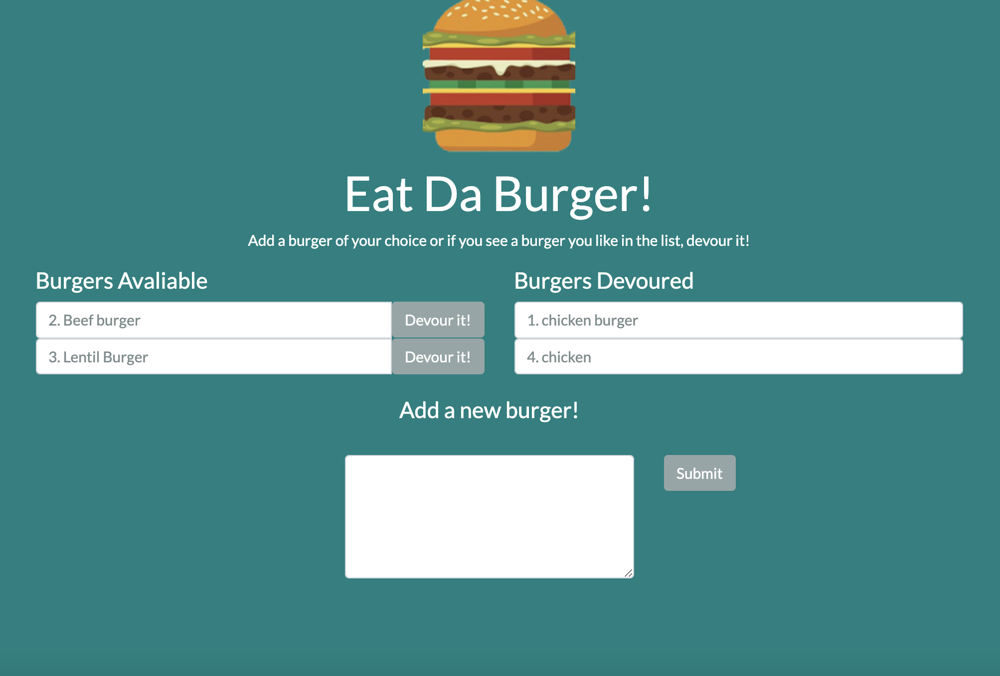

# burger

For this assingment, we were tasked to make an application with MySQL, Node, Express, Handlebar and ORM. The application lets a user input a burger and once they submit the burger it displays the burger on the left hand side with a devour button. Once the burger has been devoured, it moves the burger to the right hand side.

## Contents

This application consists of 1 main file, server.js. It also has a config folder which includes the connection and orm file. The controllers folder includes the routes. The db folder includes the database. The models folder includes the functions for the orm. The public folder includes the css and images. The views folder includes the handlebars files for the HTML and a package.json file which has the dependancies for the application.

## Usage

To use this application, git clone this repository. Once you have git cloned, run npm install to install the dependencies for the application which are:

- Express
- Express-handlebars
- MySQL

The application can be invoked with node server.

## Screenshots

## Link to the application

<a href="https://ancient-ridge-24709.herokuapp.com/">Link to the application</a>

## Built With

- VS Code - (https://code.visualstudio.com/)
- Terminal
- Express
- Handlebars
- Node
- ORM

## License

This application does not have a license.

## Author

Chloe Blackwell 
Email: chloeblackwell2@hotmail.com
